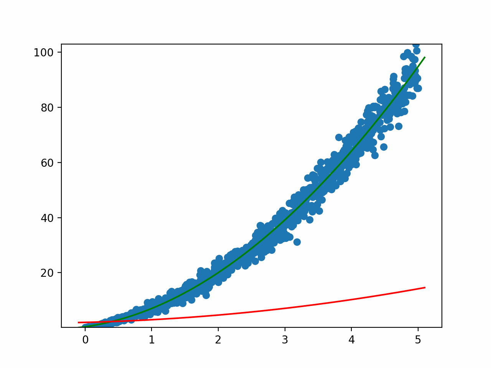

# Neural Network Learning
This is a project where I attempt to create my own multilayer neural network in Rust. By doing this, I learned about logstic regression, cost minimization, stochastic gradient descent, momentum, and much more.

# Regression
In this folder, I created some Python scripts to visualize the cost gradient and how a cost minimization algorithm would work.

## Linear Regression
Here, we are trying to minimize the distance between all the points and the closest point on the line (least squares). For this we must find the optimal arguments for the slope `m` and the y-intercept `b`. On the left, we have the line and the data points. On the right, we have the cost gradient. The green line represents the line of best fit. The red is the one we are trying to optimize.

## Polynomial Regression
This is essentially the same thing as linear regression but instead of just `m` and `b`, we can have any number of variables `a`, `b`, `c`, etc that must be optimized to minimize the distance between the polynomial of any degree and scattered points. 

